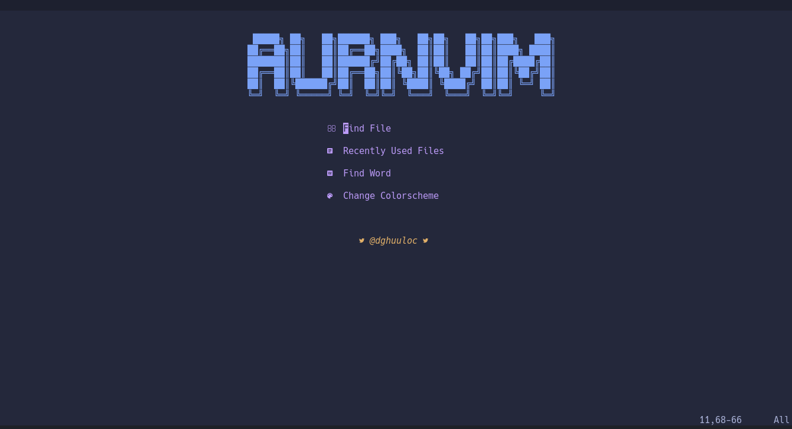

# <div align="center">AurnVim</div>
  
## Introduction to AurnVim
[Neovim](https://neovim.io/) LUA configuration, oriented for web developers (**html, css, javascript, python**).
I use **AurnVim** as a main IDE for development Website and I hope that it will be useful to other.
The project is constantly changing.

---

<p align="center">

</p>

---

# Guide pre-installing neovim and configuring
## Get the latest version of Neovim
First, get the dependencies. For distributions other than Ubuntu or Arch 
``` bash
#Ubuntu
sudo apt-get install gettext libtool-bin autoconf automake cmake g++ pkg-config unzip build-essential
#Arch
sudo pacman -S base-devel cmake unzip ninja tree-sitter
```
Download and compile Neovim
``` bash
cd $(mktem -d)
git clone https://github.com/neovim/neovim --depth 1
cd neovim
sudo make CMAKE_BUILD_TYPE=Release install
cd ..
sudo rm -r neovim
```
or if you are using Arch you can fet it from the AUR
``` bash
yay -S neovim-git
```
## Installation Instructions 

1. Git clone Lua Language Server Repo
``` bash
cd .config/nvim
git clone https://github.com/sumneko/lua-language-server
cd lua-language-server
git submodule update --init --recursive
```
2. Build language Lua Server
``` bash
cd 3rd/luamake
compile/install.sh
cd ../..
./3rd/luamake/luamake rebuild
```
## Formatting and Auto-Format

1. Install LuaRocks (***required***)
- First, build and install Lua:
``` bash
$ curl -R -O http://www.lua.org/ftp/lua-5.4.4.tar.gz
$ tar zxf lua-5.4.4.tar.gz
$ cd lua-5.4.4
$ make all test
$ sudo make install
$ cd $HOME
$ sudo rm -rfv lua-5.4.4 && sudo rm lua-5.4.4.tar.gz
```
- Download and install luarocks (***required***)
``` bash
$ wget https://luarocks.org/releases/luarocks-3.8.0.tar.gz
$ tar zxpf luarocks-3.8.0.tar.gz
$ cd luarocks-3.8.0
$ ./configure && make && sudo make install
$ sudo luarocks install luasocket
$ sudo rm -rfv luarocks-3.8.0 && sudo rm luarocks-3.8.0.tar.gz
$ lua
```

2. Install Luaformatter (***required***)

**Requirements**
	- C++ compiler
	- luarocks

Luaformatter is installed using [LuaRocks](https://github.com/luarocks/luarocks)

``` bash
sudo luarocks install --server=https://luarocks.org/dev luaformatter
```

3. Install & Configuration Golang

- Installing `go` on Arch linux
``` bash
sudo pacman -S go
```
- Confirm `go` version
``` bash
go version
```
- Updates GOPATH and reloaded .zshrc
```.zshrc
export GOROOT=/usr/lib/go
export GOPATH=$HOME/.go
export PATH=$PATH:$GOROOT/bin:$GOPATH/bin
```
- Testing `go` language on your system
``` go
package main

import "fmt"

func main() {
	fmt.Printf("hello, world\n")
}
```
- Compile and run hello.go
``` bash
go run hello.go
```

4. Install efm-language-server (***required***)

**Arch LInux Distro**

If you're using Arch Distro, You can installefm-language-server usign command:

```
sudo pacman -S efm-langserver
```

**Others**

We will need to make sure `go` installed, also you will need to put the go.bin dir in your PATH

``` bash
sudo go get github.com/mattn/efm-langserver
```
## Installation (***required***)
``` bash
$ git clone https://github.com/dghuuloc/AurnVim.git ~/.config/nvim 
$ cd .config/nvim
$ nvim
:PackerInstall
:PackerSync
```
#### lazygit

```
$ yay -Sy lazygit
```

#### pyright

```
$ npm install -g pyright
```

#### live-server

```
$ npm install -g live-server
```
